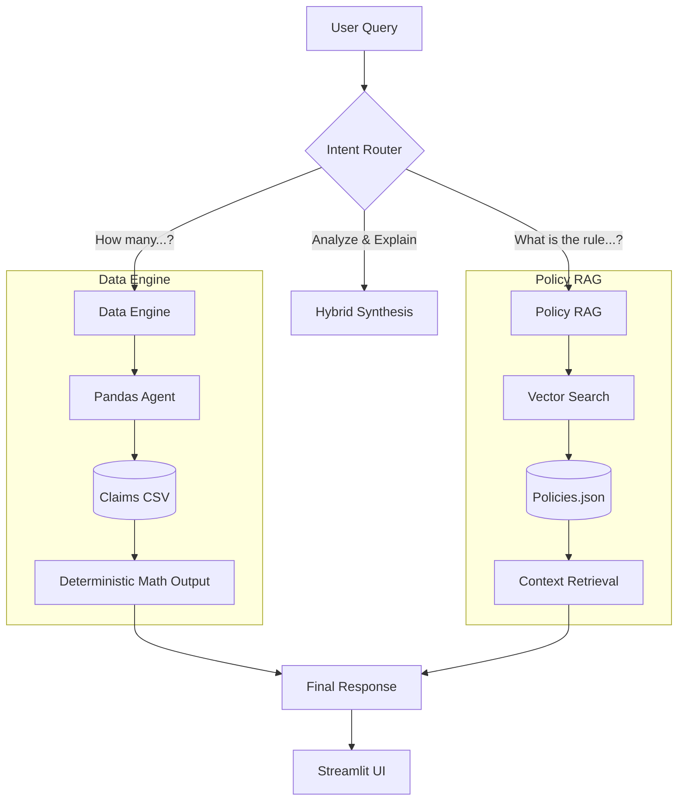

# Autonomous Claims Intelligence Agent 🤖
### Democratizing Payer Data: Hybrid RAG + Real-Time Analytics

[](https://streamlit.io/)
[](https://www.python.org/)
[](https://groq.com/)
[](https://langchain.com/)

> **Mission:** To bridge the gap between "Structured Data" (SQL/CSVs) and "Unstructured Knowledge" (Policy Manuals) in Healthcare Payer Operations.


## 🧠 The Problem
In modern insurance operations, data is siloed:
1.  **Hard Data** (Claims, Amounts, Denials) lives in SQL databases or CSVs.
2.  **Knowledge** (Rules, Guidelines, Form 88B) lives in PDF Handbooks.

**The Friction:** Analysts force-fit data into dashboards while manually cross-referencing policy documents. This leads to high latency in decision-making and increased denial errors.

## 💡 The Solution: Hybrid Intent Routing
This agent does not rely on a standard LLM to "guess" numbers. Instead, it uses a **Hybrid Router** to split the "Brain" into two distinct engines:

1.  **The Mathematician (Data Engine):** Executes deterministic Python/Pandas code for 100% accurate aggregations (Count, Sum, Trends).
2.  **The Librarian (Policy Engine):** Uses Vector Search (RAG) to retrieve specific clauses from policy documents.

### System Architecture



## ✨ Key Features

- **Zero-SQL Analytics**: Users can ask "How many diabetes claims were denied last month?" without knowing SQL. The agent generates the logic in real-time.

- **Trust-Centric UI**: Answers include "Glass Box" evidence—expandable tabs showing the raw data rows or policy text used to generate the answer.

- **Robust ETL**: Includes a custom date-parsing engine to handle messy real-world CSV date formats (ISO, Excel Serial, etc.).

- **Intent Classification**: A lightweight heuristic router classifies queries with near-zero latency, ensuring the LLM is only used when necessary.

## 🛠️ Tech Stack

- **LLM**: Llama 3 (via Groq) for sub-second inference.
- **Orchestration**: LangChain (Custom Tool Routing).
- **Frontend**: Streamlit.
- **Data Processing**: Pandas (Python).
- **Vector Store**: FAISS / Semantic Search.

## 🚀 How to Run Locally

Follow these steps to set up the project on your machine.

### 1. Clone the Repository

```bash
git clone https://github.com/YOUR_USERNAME/autonomous-claims-agent.git
cd autonomous-claims-agent

### 2. Install Dependencies

```bash
pip install -r requirements.txt
```

### 3. Set up Environment

Create a `.env` file in the root directory and add your Groq API Key:

```bash
GROQ_API_KEY=gsk_your_key_here
```

### 4. Generate Data & Run

```bash
# Generate synthetic medical claims data
python generate_data.py

# Launch the Agent
streamlit run app.py
```

## 👨‍💻 Author

**Tejas Kamble** - AI/ML Engineer | Generative AI Specialist

Built as a proof-of-concept for Abacus Insights to demonstrate the future of "Liquid Data" in Payer Operations.
